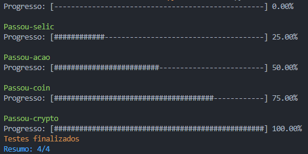

## Aplicação em python cujo objetivo é a busca de dados de ativos em api's públicas e a inserção em um banco de dados MYSQL.
## Ativos disponíveis:
  - Selic
  - Cryptomoedas
  - Ações
  - Moedas
## Contextualização
### A aplicação busca dados de ativos em APIs públicas e os insere em um banco de dados MySQL, enquanto realiza a filtragem de acordo com o tempo em que cada ativo foi inserido no banco de dados. Os dados capturados incluem valor, volume, alta, baixa, entre outros. Essas operações são realizadas de forma cíclica, com o script sendo executado a cada 30 minutos para repetir todas as operações.
## Integração google sheets
### Toda vez que ocorre um erro na busca de dados das APIs, um registro é feito em uma planilha do Google. Esses registros permitem verificar o momento em que o erro ocorreu, a natureza do erro e qual ativo foi afetado.
[Planilha possíveis erros](https://docs.google.com/spreadsheets/d/1M9elUTiwC6xOfnSNlEyGnaBltqkPwl0m2HZtOwOiBwY/edit?usp=sharing)
## Api's utilizadas
  - https://api.bcb.gov.br/
  - http://economia.awesomeapi.com.br/
  - https://api.mercadobitcoin.net/
  - yfinance (python)
## Executar a aplicação
### `python -u main.py`
## Executar os testes
### `python -u tests.py`
## Exemplo de log dos testes

  

